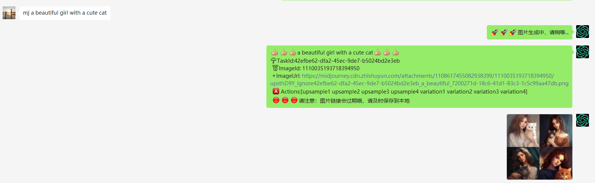

## 介绍

**🔔 注意：以下`[]`符号内代表此处是需要填写内容，并且不需要`[]`符号**

* 插件名：MidJourney
* 权限：所有好友和群聊
* 指令：
    * [x] `set mj token [token]` 设置midjourney的token
    * [x] `del mj token` 删除midjourney的token
    * [x] `add mj whitelist [微信id]` 添加白名单
    * [x] `del mj whitelist [微信id]` 删除白名单
    * [x] `/mj [你的prompt]`
    * [x] `/mj [生成的图片id] [操作]`

## 预览：

